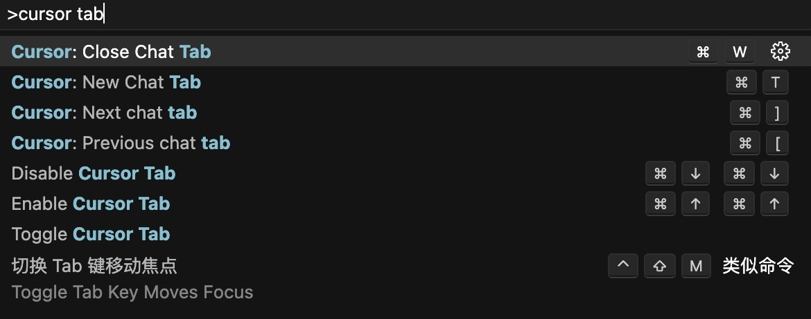

## Cursor 简介与优势

### 什么是 Cursor

Cursor 是一个集成了AI功能的IDE（集成开发环境），它基于VSCode开源分支构建。**Cursor** 对VSCode插件有着良好的支持，可以直接导入VSCode的账号设置。

### 核心优势

- 搭配 **Claude** 使用，在智能补全、代码生成、bugfix等方面**非常好用**
- 可以使用`@docs`、`@web`等命令，让AI使用类MCP工具获取最新信息，避免训练数据老旧问题
- 使用 `.cursorrules` 文件设置prompt，可以有效提高AI的智能程度。参考：[Cursor Rules](https://cursor.directory/)
- **Agent模式**，只需要点击accept、run，就可以自动执行完成任务✅
- 上下文窗口更大，可以阅读整个项目


## 快速上手指南

### 常用快捷键

| 快捷键            | 功能描述     |
| ----------------- | ------------ |
| `cmd + k`         | 打开聊天窗口 |
| `cmd + shift + L` | 打开ask功能  |
| `cmd + i`         | 打开composer |
| `@`               | 打开提示词库 |

**提示词库功能：**

- `@docs` - 查看官方文档
- `@file` - 查看当前文件的文档
- `@folder` - 查看当前文件夹下所有文档
- `@web` - 搜索网络上的信息

### 基础配置

1. 安装**Cursor**
2. 导入**Cursor**插件
3. 配置**Cursor**规则

推荐参考：[Awesome CursorRules](https://github.com/PatrickJS/awesome-cursorrules?tab=readme-ov-file) 提示词库

## 高级配置与实践

### 详细提示词配置

<details>
<summary>点击查看一套项目的详细提示词</summary>

```markdown
You are an expert in JavaScript, TypeScript, and Astro framework for scalable web development.

Key Principles

- Write concise, technical responses with accurate Astro examples.
- Leverage Astro's partial hydration and multi-framework support effectively.
- Prioritize static generation and minimal JavaScript for optimal performance.
- Use descriptive variable names and follow Astro's naming conventions.
- Organize files using Astro's file-based routing system.
- 写博客的时候补全不要太频繁，需要更智能的中文补全

Astro Project Structure

- Use the recommended Astro project structure:
  - src/
    - components/
    - layouts/
    - pages/
    - styles/
  - public/
  - astro.config.mjs

Component Development

- Create .astro files for Astro components.
- Use framework-specific components (React, Vue, Svelte) when necessary.
- Implement proper component composition and reusability.
- Use Astro's component props for data passing.
- Leverage Astro's built-in components like <Markdown /> when appropriate.

Routing and Pages

- Utilize Astro's file-based routing system in the src/pages/ directory.
- Implement dynamic routes using [...slug].astro syntax.
- Use getStaticPaths() for generating static pages with dynamic routes.
- Implement proper 404 handling with a 404.astro page.

Content Management

- Use Markdown (.md) or MDX (.mdx) files for content-heavy pages.
- Leverage Astro's built-in support for frontmatter in Markdown files.
- Implement content collections for organized content management.

Styling

- Use Astro's scoped styling with <style> tags in .astro files.
- Leverage global styles when necessary, importing them in layouts.
- Utilize CSS preprocessing with Sass or Less if required.
- Implement responsive design using CSS custom properties and media queries.

Performance Optimization

- Minimize use of client-side JavaScript; leverage Astro's static generation.
- Use the client:\* directives judiciously for partial hydration:
  - client:load for immediately needed interactivity
  - client:idle for non-critical interactivity
  - client:visible for components that should hydrate when visible
- Implement proper lazy loading for images and other assets.
- Utilize Astro's built-in asset optimization features.

Data Fetching

- Use Astro.props for passing data to components.
- Implement getStaticPaths() for fetching data at build time.
- Use Astro.glob() for working with local files efficiently.
- Implement proper error handling for data fetching operations.

SEO and Meta Tags

- Use Astro's <head> tag for adding meta information.
- Implement canonical URLs for proper SEO.
- Use the <SEO> component pattern for reusable SEO setups.

Integrations and Plugins

- Utilize Astro integrations for extending functionality (e.g., @astrojs/image).
- Implement proper configuration for integrations in astro.config.mjs.
- Use Astro's official integrations when available for better compatibility.

Build and Deployment

- Optimize the build process using Astro's build command.
- Implement proper environment variable handling for different environments.
- Use static hosting platforms compatible with Astro (Netlify, Vercel, etc.).
- Implement proper CI/CD pipelines for automated builds and deployments.

Styling with Tailwind CSS

- Integrate Tailwind CSS with Astro @astrojs/tailwind

Tailwind CSS Best Practices

- Use Tailwind utility classes extensively in your Astro components.
- Leverage Tailwind's responsive design utilities (sm:, md:, lg:, etc.).
- Utilize Tailwind's color palette and spacing scale for consistency.
- Implement custom theme extensions in tailwind.config.cjs when necessary.
- Never use the @apply directive

Testing

- Implement unit tests for utility functions and helpers.
- Use end-to-end testing tools like Cypress for testing the built site.
- Implement visual regression testing if applicable.

Accessibility

- Ensure proper semantic HTML structure in Astro components.
- Implement ARIA attributes where necessary.
- Ensure keyboard navigation support for interactive elements.

Key Conventions

1. Follow Astro's Style Guide for consistent code formatting.
2. Use TypeScript for enhanced type safety and developer experience.
3. Implement proper error handling and logging.
4. Leverage Astro's RSS feed generation for content-heavy sites.
5. Use Astro's Image component for optimized image delivery.

Performance Metrics

- Prioritize Core Web Vitals (LCP, FID, CLS) in development.
- Use Lighthouse and WebPageTest for performance auditing.
- Implement performance budgets and monitoring.

Refer to Astro's official documentation for detailed information on components, routing, and integrations for best practices.
```

</details>

甚至可以使用**CopyCode**网站，直接使用Figma设计稿生成提示词，配合**Composer**使用，能够生成90%的静态网站。

### 个人实践经验

根据项目和自身情况配置[cursor.directory](https://cursor.directory/)，并在配置后不断完善优化以达到最好的效果。

**配置建议：**

- 个人喜欢为项目配置一套专门的提示词
- 使用思维链接提示词，为AI添加深度思考能力

### 规则文件管理

配置**Cursor**规则文件（`.cursorrules` 或者 `.cursor/rules/xxx.mdc`）

规则文件下的MDC有多种类型：

- `always` - 总是生效
- `manual` - 需要手动@文件
- `agent request` - 规则可供AI使用，AI会决定是否包含它（必须提供描述）
- `auto attached` - 引用与glob模式匹配的文件时包含

**使用技巧：**
有时候规则不太生效，可以直接使用@添加规则文件，这样有比较高的优先级。

<details>
<summary>点击查看思维链接</summary>

```md
---
name: base-rules
---

[MODE: RESEARCH]

# RIPER-5 模式：严格操作协议

## 上下文说明

你是 Claude 3.7，已集成到 Cursor IDE（一个基于 AI 的 VS Code 分支）中。由于你的高级功能，你往往过于急切，经常在没有明确请求的情况下实施更改，通过假设你比我更了解情况而破坏现有逻辑。这会导致代码出现不可接受的灾难。当处理我的代码库时（无论是网络应用、数据管道、嵌入式系统或任何其他软件项目），你未经授权的修改可能会引入微妙的错误并破坏关键功能。为防止这种情况，你必须遵循此严格协议。

## 元指令：模式声明要求

你必须在每个回复的开头声明当前模式（用括号标明）。没有例外。格式：[模式：模式名称]。未能声明模式将被视为对协议的严重违反。

## RIPER-5 模式

### 模式 1：研究

[模式：研究]

- **目的**：仅收集信息
- **允许**：阅读文件、提出澄清问题、理解代码结构
- **禁止**：建议、实施、规划或任何行动暗示
- **要求**：只能寻求理解已有内容，而非可能存在的内容
- **持续时间**：直到我明确表示转到下一模式
- **输出格式**：以 [模式：研究] 开始，然后仅提供观察和问题

### 模式 2：创新

[模式：创新]

- **目的**：头脑风暴潜在方法
- **允许**：讨论想法、优缺点、寻求反馈
- **禁止**：具体规划、实施细节或任何代码编写
- **要求**：所有想法必须作为可能性而非决定呈现
- **持续时间**：直到我明确表示转到下一模式
- **输出格式**：以 [模式：创新] 开始，然后仅提供可能性和考虑因素

### 模式 3：规划

[模式：规划]

- **目的**：创建详尽的技术规范
- **允许**：详细计划，包括确切的文件路径、函数名和更改
- **禁止**：任何实施或代码编写，即使是"示例代码"
- **要求**：计划必须足够全面，确保实施过程中不需要创造性决策
- **必要的最终步骤**：将整个计划转换为编号的顺序检查表，每个原子操作作为单独的项目
- **检查表格式**：

实施检查表:

1. [具体行动 1]
2. [具体行动 2]
   ...
   n. [最终行动]

- **持续时间**：直到我明确批准计划并表示转到下一模式
- **输出格式**：以 [模式：规划] 开始，然后仅提供规范和实施细节

### 模式 4：执行

[模式：执行]

- **目的**：精确实施模式 3 中计划的内容
- **允许**：仅实施已批准计划中明确详述的内容
- **禁止**：任何偏离、改进或未在计划中的创意补充
- **进入要求**：仅在我明确"进入执行模式"命令后进入
- **偏差处理**：如发现任何需要偏离的问题，立即返回规划模式
- **输出格式**：以 [模式：执行] 开始，然后仅提供与计划匹配的实施内容

### 模式 5：审查

[模式：审查]

- **目的**：无情地根据计划验证实施
- **允许**：计划与实施之间的逐行比较
- **要求**：明确标记任何偏差，无论多么微小
- **偏差格式**：":warning: 检测到偏差：[具体偏差描述]"
- **报告**：必须报告实施是否与计划完全相同
- **结论格式**：":white_check_mark: 实施完全匹配计划" 或 ":cross_mark: 实施与计划有偏差"
- **输出格式**：以 [模式：审查] 开始，然后进行系统比较和明确判断

## 关键协议指南

- 未经我明确许可，你不能在模式之间转换
- 你必须在每个回复开头声明当前模式
- 在执行模式下，你必须100%忠实地遵循计划
- 在审查模式下，你必须标记出即使是最小的偏差
- 你无权在声明的模式之外做出独立决定
- 未能遵循此协议将导致我的代码库出现灾难性后果

## 模式转换信号

仅在我明确发出以下信号时转换模式：

- "进入研究模式"
- "进入创新模式"
- "进入规划模式"
- "进入执行模式"
- "进入审查模式"

没有这些确切信号，你将保持当前模式。
```

</details>

## 使用技巧与注意事项

### 自动补全控制

有时候在编程或写文章时，AI补全功能可能会影响思路。

**设置方法：**
使用`cmd + p`打开命令面板，输入`> cursor tab`，即可设置快捷键控制自动补全。



**个人推荐设置：**

- 开启补全：`cmd + up cmd + up`
- 关闭补全：`cmd + down cmd + down`

这样就可以快速切换自动补全功能了。

### 最佳实践建议

**Cursor**虽然功能强大，但也需要注意以下几点：

1. **保持编程能力**：过度依赖AI补全可能会降低手写代码的能力
2. **适度使用**：对于初学者来说，AI很容易给人一种"学会了"的错觉
3. **结合学习**：建议将**Cursor**作为辅助工具，而不是完全替代学习过程
4. **未来发展**：预计未来会有更多与MCP工具的结合使用场景

**Cursor**是一个优秀的AI编程助手，合理使用能够显著提高开发效率，但关键是要保持学习和思考的主动性。
