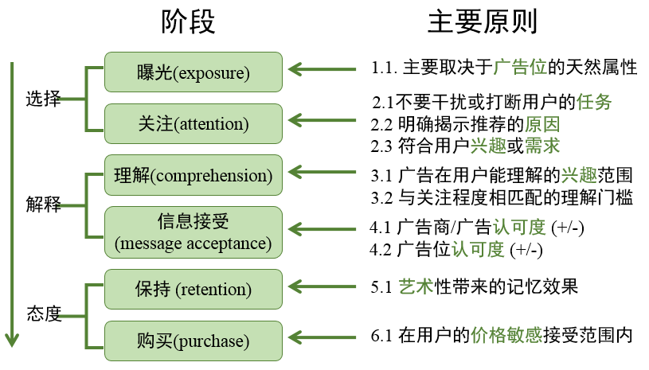

## 阅读计算广告

## 在线广告综述

产品的三大可变现的核心资产

- 流量
- 数据 （用户性别,行为，用户行为，意图等等
- 影响力

## 广告概念

- 出资人（sponsor
- 媒体
- 受众

**广告的本质功能**：是借助某种有广泛受众的媒介的力量，完成较低成本的用户接触 (reach)

投入产出比 ROI (Return on Investment)

**_品牌广告与效果广告_**

**品牌广告：**创造独特良好的品牌或产品形象， 目的在于提升较长时期内的离线转化率

**效果广告**：有短期内明确用户转化行为诉求的广告。用户转化行为例如：购买， 注册，投票，捐款等。大部分互联网广告都是这种类型。

### 定向广告系统

- 受众定向（audience targeting)
- 广告投放 (ad serving)

<aside>
💡

eg: 剃须刀🪒面向成年男性投放

对于媒体这部分数据也就成为价值了

</aside>

担保式投送(guaranteed delivery，GD) 和品牌宣传CPM比较相关

最常用的eCPM (expect cost per Mile) 千次展示期望收入

### 竞价广告

广告网络 ADN (ad network)

-

CPC (cost per click) 按点击收费

千次展示收益（revenue per mille，RPM）

### 实时竞价

（real time bidding，RTB）

### 广告的有效性模型

# 2.计算广告基础

> 千次展示期望收入（expected cost per mille, eCPM）

$$
ecpm = r(a,u,c) = u(a,u,c) * v(a,u) = u(a,u,c)*c(a,u)*t(a)
$$

广告活动3个参与活动

a,u,c 广告，用户，上下文

点击率\*点击价值进一步拆分为点击率，转化率，转化价值

## 广告计费方式

### CPT

cost per time: 门户网站，计时间

### CPM

cost per mile: 每千次展示收费

### CPC

cost per click

### CPS/CPA/ROI

cost per sale,cosr per action,

### oCPX

在线广告计费模式比较

| 计费模式                   | 点击率估计               | 点击价值估计 | 优缺点                           | 使用场景               |
| -------------------------- | ------------------------ | ------------ | -------------------------------- | ---------------------- |
| CPT                        | 需求方                   | 需求方       | 可以发挥橱窗效应                 |
| 无法使用受众定向技术       | 高曝光的品牌广告         |
| CPM                        | 需求方                   | 需求方       | 可以通过受众定向技术选择目标人群 |
| 合约售卖下受众划分不能过细 | 有受众选择需求的品牌广告 |
| 实时竞价广告交易           |
| CPC                        | 供给方                   | 需求方       | 可以精细划分不同受众人群         |
| 比较合理的分工方式         | 竞价广告网络             |
| CPS/CPA/ROI                | 供给方                   | 供给方       | 需求方无任何方向                 |
| 供给方运营难度较大         | 效果类广告联盟           |
| 效果类DSP                  |
| oCPX                       | 供给方                   | 供给方       | 向CPA模式过渡                    | 数据能力较强的广告平台 |

## 在线广告产品逻辑

$$在线广告发展历史$$

2.3.1 广告收入分解

CTR （click through rate）点击率

CVR (conversion rate) 转化率

## 竞价广告

### 竞价广告策略

> 纳什平衡：市场平衡稳定

状态公示：

竞价机制

- 广义第二高价 （GSP)
  - 即广告主以第一价格获取到位置，以第二高价支付。机制相对简单且稳定
- VCG
  - 社会福利最优

MRP:市场保留价 （即底价）

竞价广告的计算分工与产品方向

| 计费模式   | 点击率 | 转化率 | 转化价值 | 产品关键 |
| ---------- | ------ | ------ | -------- | -------- |
| CPC竞价    | 供给方 | 需求方 | 需求方   |          |
| 程序化交易 | 需求方 | 需求方 | 需求方   | 实时报价 |
| 智能投放   | 供给方 | 供给方 | 需求方   | oCPX     |

<aside>
💡

CPC竞价在PC端早期竞价市场最多，计算分工也比较符合逻辑，又媒体方负责计算点击率相关。广告主负责转化率，转化价值。

</aside>

<aside>
💡

程序化交易更适合有信息能力，数据能力的客户

</aside>

<aside>
💡

智能投放门槛更低，由供给方承担计算数据服务，更适合中小客户

一般采用oCPX(注：x可以为C或者M.)
Q：CPS/CPA/ROI也是由供给方负责点击，转换，为什么不采用？

A：按sale，容易出现劣币驱赶良币现象，低质量的产品获取到更多的流量，如手工狄的无用机械作品

</aside>

### 程序化交易广告

DSP 需求方平台

SSP 供应方平台
