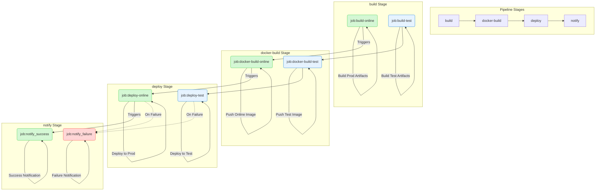

Docker 解决「在哪台机器上都能跑起来」，CI/CD 解决「提交之后自动构建、测试、部署」。GitLab 流水线里常见的 `docker-build` 阶段，就是把这两块接在一起。

## Docker

Docker 是一种容器技术，**只隔离应用程序的运行时环境，容器之间可以共享同一个操作系统**。可以把它理解成更轻量的虚拟机，用的仍是本机操作系统。

对前端来说，它也更容易嵌进 CI：给流水线设 *Lint / Test / Security / Audit / Deploy / Artifact* 等任务，把质量卡在自动化里。

> 换 macOS、Windows、Linux 时，装好 Docker 就能跑同一份应用。多人、多环境要跑通同一个项目，同样只需要 Docker。


### 镜像、容器、仓库

**1. 镜像（Image）**：类似虚拟机镜像，是面向 Docker 引擎的只读模板，里面带着文件系统。应用要跑，先要有环境，镜像就是提供这个环境的。Ubuntu 镜像是带 Ubuntu 系统环境的模板；在上面装 Apache，就可以称为 Apache 镜像。

**2. 容器（Container）**：轻量沙盒，可以看成一份极简 Linux（root、进程空间、用户空间、网络空间）加上跑在里面的应用。容器是镜像创建出来的实例，能创建、启动、停止、删除，彼此隔离。镜像本身只读；从镜像启动容器时，Docker 在镜像上层加一个可写层，镜像不变。

**3. 仓库（Repository）**：集中存放镜像的地方。注意和注册服务器（Registry）的区别：Registry 存放仓库，通常有多个仓库；仓库存放镜像，一般一类镜像一个仓库，用 tag 区分版本，例如 Ubuntu 仓库里的 12.04、14.04。

### Dockerfile

```docker
# 使用 node:14-alpine 基础镜像
# 带有 alpine 标签的基础镜像基于最小化的操作系统 alpine，拥有更小的体积
FROM node:14-alpine

ENV PROJECT_ENV production

# 许多 package 会根据此环境变量，做出不同的行为
# 另外，在 webpack 中打包也会根据此环境变量做出优化，但是 create-react-app 在打包时会写死该环境变量
# 注意: 该环境变量有时可能引起问题
# ENV NODE_ENV production# 设置工作文件夹
WORKDIR

# 拷贝本地文件到镜像中
COPY ..

# 暴露端口号
EXPOSE 3000

#
CMD ['','']
```

[dockerfile 最佳实践](https://shanyue.tech/op/dockerfile-practice.html#%E5%AE%B9%E5%99%A8%E5%BA%94%E8%AF%A5%E6%98%AF%E7%9F%AD%E6%9A%82%E7%9A%84)

## CI/CD

开发人员提交新代码后马上构建、（单元）测试，再根据结果判断能不能和已有代码集成，这是持续集成（Continuous Integration）。

持续交付（Continuous Delivery）在持续集成之上，把集成后的代码部署到更接近真实环境的「类生产环境」。例如单元测试过了，再部署到连着数据库的 Staging 里做更多测试；没问题再手动上生产。

持续部署（Continuous Deployment）再往前一步：上生产也自动化。

国内公司多用 GitLab，复杂流程写在 GitLab workflow 里即可，原理和 GitHub Actions 相通。

### GitHub Actions

项目里建 `.github/workflows`，再放 `.yml` / `.yaml`。YAML 语法可参考 [Learn YAML in Y minutes](https://learnxinyminutes.com/docs/yaml/)，官方说明见 [Workflow syntax](https://docs.github.com/en/actions/writing-workflows/workflow-syntax-for-github-actions)。

下面是 [MongoRolls/auto-robot](https://github.com/MongoRolls/auto-robot) 的例子：定时自动 commit 刷小绿点（需要配置，并手动打开 Action 权限）。

```yaml
name: autocommit-robot

on:
  schedule:
    - cron: '0 0 * * *'
  workflow_dispatch: # 允许手动触发工作流

jobs:
  bots:
    runs-on: ubuntu-latest
    permissions:
      contents: write # 明确给予写入内容的权限
    steps:
      - name: 'Checkout code'
        uses: actions/checkout@v3 # 更新到v3

      - name: 'Set node'
        uses: actions/setup-node@v3 # 更新到v3
        with:
          node-version: 16.x

      - name: 'Install'
        run: npm install

      - name: 'Run bash'
        run: node index.js

      - name: 'Commit'
        uses: EndBug/add-and-commit@v9 # 更新到v9
        with:
          author_name: mongorolls
          author_email: xuzhichao1618@qq.com
          message: 'feat: save robot'
          add: 'pictures/*'
        env:
          GITHUB_TOKEN: ${{ secrets.MONGO }}
```

`on` 里的事件（push、定时、手动触发等）会启动 job：在虚拟机上配环境，再跑指定步骤。个人前端项目用 GitHub Actions + Vercel 就很省心。

### GitLab CI

GitLab 用 `.gitlab-ci.yml`。[GitLab CI 文档](https://docs.gitlab.com/ci/)

```yaml
# 依赖镜像
image: xxx

# 启动Dind服务
services:
	- name:
		entrypoint:
		alias: docker

# 定义变量
variables:
	DOCKER_IMAGE_ONLINE_NAME: $ci_xxxx
	DOCKER_IMAGE_DEV_NAME: $ci_xxxx
	DOCKER_IMAGE_TEXT_NAME: $ci_xxxx

# 定义阶段
stages:
  - build
  - docker-build
  - deploy
  - notify

# job名称
job-build-dev:
  # 指定该任务必须运行在带有"k8s"标签的GitLab Runner
  tags:
    - k8s
  # 指定是某个阶段
  stage: build
  # 拉取基础镜像, push镜像在deploy阶段
  image: harbor-registry.inner.youdao.com/ead-test/node20.17.0-pm2
  script:
    - node -v
    - npm -v
    - npm config set registry 'https://registry.npmjs.org'
    - npm install -g yarn
 pi
```

流水线通常是 `build` → `docker-build` → `deploy` → `notify`：先出构建产物，再打镜像、推仓库，然后部署，最后按成功或失败发通知。


