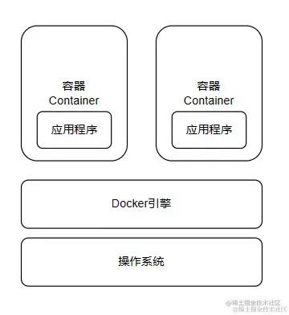

## 介绍

Docker🐳 是一种容器技术，**只隔离应用程序的运行时环境但容器之间可以共享同一个操作系统**，可以理解成一个更轻量级的 *虚拟机* 并且使用的是本机的操作系统。

对于前端而言，在 CI 环境中使用也更容易集成开发，测试与部署。比如可以为流水线(Pipeline)设置 *Lint/Test/Security/Audit/Deploy/Artifact* 等任务，更好地把控项目质量。

> 举个例子  
> 当你使用不同系统mac, windows, linux 时，你只需要安装 Docker 就可以在不同系统上运行相同的应用程序。
> 再者，如果有多人多环境想要跑通这个项目，你只需要安装 Docker 就可以在不同系统上运行相同的应用程序。



## 概念

**1. 镜像（Image）**：类似于虚拟机中的镜像，是一个包含有文件系统的面向Docker引擎的只读模板。任何应用程序运行都需要环境，而镜像就是用来提供这种运行环境的。例如一个Ubuntu镜像就是一个包含Ubuntu操作系统环境的模板，同理在该镜像上装上Apache软件，就可以称为Apache镜像。

**2. 容器（Container）**：类似于一个轻量级的沙盒，可以将其看作一个极简的Linux系统环境（包括root权限、进程空间、用户空间和网络空间等），以及运行在其中的应用程序。Docker引擎利用容器来运行、隔离各个应用。容器是镜像创建的应用实例，可以创建、启动、停止、删除容器，各个容器之间是是相互隔离的，互不影响。_注意：镜像本身是只读的，容器从镜像启动时，Docker在镜像的上层创建一个可写层，镜像本身不变。_

**3. 仓库（Repository）**：类似于代码仓库，这里是镜像仓库，是Docker用来集中存放镜像文件的地方。注意与注册服务器（Registry）的区别：注册服务器是存放仓库的地方，一般会有多个仓库；而仓库是存放镜像的地方，一般每个仓库存放一类镜像，每个镜像利用tag进行区分，比如Ubuntu仓库存放有多个版本（12.04、14.04等）的Ubuntu镜像。

## Dockerfiles

```docker
# 使用 node:14-alpine 基础镜像
# 带有 alpine 标签的基础镜像基于最小化的操作系统 alpine，拥有更小的体积
FROM node:14-alpine

ENV PROJECT_ENV production

# 许多 package 会根据此环境变量，做出不同的行为
# 另外，在 webpack 中打包也会根据此环境变量做出优化，但是 create-react-app 在打包时会写死该环境变量
# 注意: 该环境变量有时可能引起问题
# ENV NODE_ENV production# 设置工作文件夹
WORKDIR

# 拷贝本地文件到镜像中
COPY ..

# 暴露端口号
EXPOSE 3000

#
CMD ['','']
```

[dockerfile 最佳实践](https://shanyue.tech/op/dockerfile-practice.html#%E5%AE%B9%E5%99%A8%E5%BA%94%E8%AF%A5%E6%98%AF%E7%9F%AD%E6%9A%82%E7%9A%84)
