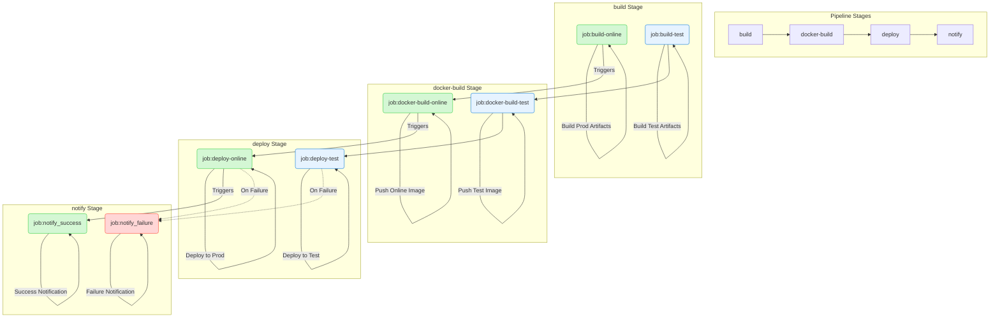

## 概念

开发人员提交新代码后，马上进行构建，（单元）测试，根据结果判断是否能够与老代码集成

持续交付（Continuous Delivery，CD）

持续交付在持续集成的基础上，将集成后的代码部署到更贴近真实运行环境的「类[生产环境](https://zhida.zhihu.com/search?content_id=31205888&content_type=Answer&match_order=1&q=%E7%94%9F%E4%BA%A7%E7%8E%AF%E5%A2%83&zhida_source=entity)」（_production-like environments_）中。比如，我们完成单元测试后，可以把代码部署到连接数据库的 Staging 环境中更多的测试。如果代码没有问题，可以继续手动部署到生产环境中。

持续部署（Continuous Deployment）

持续部署则是在持续交付的基础上，把部署到生产环境的过程自动化。

一般国内企业都是使用gitlab，重点把复杂流程写在gitlab workflow即可，原理互通

## github

GitHub Actions 工作流配置

在项目目录下创建 .github/workflows 文件夹，然后创建 .yml 文件。

工作流配置文件必须使用 YAML 语法，文件扩展名为 .yml 或 .yaml。
如需了解 YAML 语法，请参考 [Learn YAML in Y minutes](https://learnxinyminutes.com/docs/yaml/)

### 例子

[官方语法文档](https://docs.github.com/en/actions/writing-workflows/workflow-syntax-for-github-actions)

下面是一个例子https://github.com/MongoRolls/auto-robot

这是一个定时自动打卡commit刷小绿点（ps:需要配置，需要手动开启action权限）

```yaml
name: autocommit-robot

on:
  schedule:
    - cron: '0 0 * * *'
  workflow_dispatch: # 允许手动触发工作流

jobs:
  bots:
    runs-on: ubuntu-latest
    permissions:
      contents: write # 明确给予写入内容的权限
    steps:
      - name: 'Checkout code'
        uses: actions/checkout@v3 # 更新到v3

      - name: 'Set node'
        uses: actions/setup-node@v3 # 更新到v3
        with:
          node-version: 16.x

      - name: 'Install'
        run: npm install

      - name: 'Run bash'
        run: node index.js

      - name: 'Commit'
        uses: EndBug/add-and-commit@v9 # 更新到v9
        with:
          author_name: mongorolls
          author_email: xuzhichao1618@qq.com
          message: 'feat: save robot'
          add: 'pictures/*'
        env:
          GITHUB_TOKEN: ${{ secrets.MONGO }}
```

通过触发 on 事件（如 push、pull、定时等）来启动 job 流程，系统会在虚拟机上配置环境并运行指定任务

像个人前端项目，直接使用github workflow + vercel非常省心

## gitlab

gitlab使用.gitlab-ci.yml文件作为配置

[gitlab ci 文档](https://docs.gitlab.com/ci/)

```yaml
# 依赖镜像
image: xxx

# 启动Dind服务
services:
	- name:
		entrypoint:
		alias: docker

# 定义变量
variables:
	DOCKER_IMAGE_ONLINE_NAME: $ci_xxxx
	DOCKER_IMAGE_DEV_NAME: $ci_xxxx
	DOCKER_IMAGE_TEXT_NAME: $ci_xxxx

# 定义阶段
stages:
  - build
  - docker-build
  - deploy
  - notify

# job名称
job-build-dev:
  # 指定该任务必须运行在带有"k8s"标签的GitLab Runner
  tags:
    - k8s
  # 指定是某个阶段
  stage: build
  # 拉取基础镜像, push镜像在deploy阶段
  image: harbor-registry.inner.youdao.com/ead-test/node20.17.0-pm2
  script:
    - node -v
    - npm -v
    - npm config set registry 'https://registry.npmjs.org'
    - npm install -g yarn
 pi
```

### pipeline



## 项目流程
