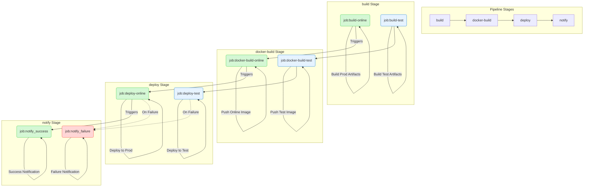

Docker answers “it runs the same on every machine.” CI/CD answers “after a commit, build, test, and deploy happen automatically.” The `docker-build` stage in a GitLab pipeline is where the two meet.

## Docker

Docker is a container technology. It **isolates only an application's runtime, while containers can share the host operating system**. Think of it as a lighter virtual machine that still uses the machine's OS.

For frontend projects it also slots into CI: a pipeline can run *Lint / Test / Security / Audit / Deploy / Artifact* and keep quality checks automated.

> Install Docker once, and the same app runs on macOS, Windows, and Linux. The same is true when several people need to run the project in different environments.


### Image, container, repository

**1. Image**: Like a virtual-machine image, a Docker image is a read-only template for the engine, with a filesystem inside. An application needs an environment; the image provides it. An Ubuntu image is a template with an Ubuntu environment; install Apache on it and it becomes an Apache image.

**2. Container**: A lightweight sandbox: a minimal Linux (root, process space, user space, network space) plus the app running in it. A container is an instance created from an image. You can create, start, stop, and delete it. Containers are isolated from one another. The image stays read-only; when a container starts, Docker adds a writable layer on top and leaves the image unchanged.

**3. Repository**: Where images are stored. A registry holds repositories (usually many of them). A repository holds images, typically one family per repository, distinguished by tags—for example Ubuntu 12.04 and 14.04 in the Ubuntu repository.

### Dockerfile

```docker
# Use node:14-alpine as the base image
# The alpine-tagged base image uses the minimal Alpine OS and is smaller
FROM node:14-alpine

ENV PROJECT_ENV production

# Many packages change their behavior according to this environment variable
# Webpack also uses it for build optimizations, although create-react-app
# hard-codes the variable during its build
# Note: this variable can sometimes cause problems
# ENV NODE_ENV production# Set the working directory
WORKDIR

# Copy local files into the image
COPY ..

# Expose a port
EXPOSE 3000

#
CMD ['','']
```

[Dockerfile best practices](https://shanyue.tech/op/dockerfile-practice.html#%E5%AE%B9%E5%99%A8%E5%BA%94%E8%AF%A5%E6%98%AF%E7%9F%AD%E6%9A%82%E7%9A%84)

## CI/CD

After a developer pushes new code, the system builds and unit-tests it, then decides whether it can merge with what is already there. That is continuous integration.

Continuous delivery deploys integrated code to a production-like environment. After unit tests, you might deploy to a staging database, then promote to production by hand if nothing breaks.

Continuous deployment automates that last step as well.

Most companies in China use GitLab and put the complex flow in a GitLab workflow. The ideas are the same as GitHub Actions.

### GitHub Actions

Create `.github/workflows` and add a `.yml` / `.yaml` file. See [Learn YAML in Y minutes](https://learnxinyminutes.com/docs/yaml/) and the [workflow syntax docs](https://docs.github.com/en/actions/writing-workflows/workflow-syntax-for-github-actions).

This example from [MongoRolls/auto-robot](https://github.com/MongoRolls/auto-robot) makes scheduled commits to fill the contribution graph. You need to configure it and enable Actions permissions.

```yaml
name: autocommit-robot

on:
  schedule:
    - cron: '0 0 * * *'
  workflow_dispatch: # Allow manually triggering the workflow

jobs:
  bots:
    runs-on: ubuntu-latest
    permissions:
      contents: write # Explicitly grant permission to write contents
    steps:
      - name: 'Checkout code'
        uses: actions/checkout@v3 # Update to v3

      - name: 'Set node'
        uses: actions/setup-node@v3 # Update to v3
        with:
          node-version: 16.x

      - name: 'Install'
        run: npm install

      - name: 'Run bash'
        run: node index.js

      - name: 'Commit'
        uses: EndBug/add-and-commit@v9 # Update to v9
        with:
          author_name: mongorolls
          author_email: xuzhichao1618@qq.com
          message: 'feat: save robot'
          add: 'pictures/*'
        env:
          GITHUB_TOKEN: ${{ secrets.MONGO }}
```

An `on` event (push, schedule, or manual dispatch) starts the job on a VM. For a personal frontend project, GitHub Actions plus Vercel is usually enough.

### GitLab CI

GitLab reads `.gitlab-ci.yml`. [GitLab CI documentation](https://docs.gitlab.com/ci/)

```yaml
# Dependency image
image: xxx

# Start the DinD service
services:
	- name:
		entrypoint:
		alias: docker

# Define variables
variables:
	DOCKER_IMAGE_ONLINE_NAME: $ci_xxxx
	DOCKER_IMAGE_DEV_NAME: $ci_xxxx
	DOCKER_IMAGE_TEXT_NAME: $ci_xxxx

# Define stages
stages:
  - build
  - docker-build
  - deploy
  - notify

# Job name
job-build-dev:
  # Require this job to run on a GitLab Runner with the "k8s" tag
  tags:
    - k8s
  # Specify the stage
  stage: build
  # Pull the base image; push the image in the deploy stage
  image: harbor-registry.inner.youdao.com/ead-test/node20.17.0-pm2
  script:
    - node -v
    - npm -v
    - npm config set registry 'https://registry.npmjs.org'
    - npm install -g yarn
 pi
```

A typical pipeline is `build` → `docker-build` → `deploy` → `notify`: produce artifacts, build and push an image, deploy, then notify on success or failure.


