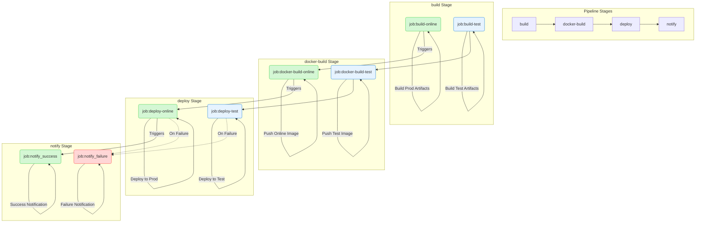

## Concepts

After a developer submits new code, the system immediately builds and unit-tests it, then uses the result to decide whether it can be integrated with the existing code.

Continuous delivery (CD) builds on continuous integration by deploying integrated code to a “production-like environment,” one closer to the real runtime environment. For example, after unit tests, we can deploy the code to a staging environment connected to a database for more testing. If there are no problems, it can then be deployed manually to production.

Continuous deployment automates the process of deploying code to production on top of continuous delivery.

Most companies in China use GitLab. In practice, the complex process can be written in a GitLab workflow; the underlying principles are the same.

## GitHub

### GitHub Actions workflow configuration

Create a `.github/workflows` folder in the project directory, then create a `.yml` file.

Workflow configuration files must use YAML syntax and have a `.yml` or `.yaml` extension. For YAML syntax, see [Learn YAML in Y minutes](https://learnxinyminutes.com/docs/yaml/).

### Example

[Official syntax documentation](https://docs.github.com/en/actions/writing-workflows/workflow-syntax-for-github-actions)

Here is an example: [MongoRolls/auto-robot](https://github.com/MongoRolls/auto-robot)

It automatically creates scheduled check-in commits to fill the GitHub contribution graph (configuration is required, and Action permissions must be enabled manually).

```yaml
name: autocommit-robot

on:
  schedule:
    - cron: '0 0 * * *'
  workflow_dispatch: # Allow manually triggering the workflow

jobs:
  bots:
    runs-on: ubuntu-latest
    permissions:
      contents: write # Explicitly grant permission to write contents
    steps:
      - name: 'Checkout code'
        uses: actions/checkout@v3 # Update to v3

      - name: 'Set node'
        uses: actions/setup-node@v3 # Update to v3
        with:
          node-version: 16.x

      - name: 'Install'
        run: npm install

      - name: 'Run bash'
        run: node index.js

      - name: 'Commit'
        uses: EndBug/add-and-commit@v9 # Update to v9
        with:
          author_name: mongorolls
          author_email: xuzhichao1618@qq.com
          message: 'feat: save robot'
          add: 'pictures/*'
        env:
          GITHUB_TOKEN: ${{ secrets.MONGO }}
```

The `on` event—such as a push, schedule, or manual dispatch—starts the job. The system configures an environment on a virtual machine and runs the specified task.

For a personal frontend project, GitHub Workflow plus Vercel is very convenient.

## GitLab

GitLab uses `.gitlab-ci.yml` as its configuration file.

[GitLab CI documentation](https://docs.gitlab.com/ci/)

```yaml
# Dependency image
image: xxx

# Start the DinD service
services:
\t- name:
\t\tentrypoint:
\t\talias: docker

# Define variables
variables:
\tDOCKER_IMAGE_ONLINE_NAME: $ci_xxxx
\tDOCKER_IMAGE_DEV_NAME: $ci_xxxx
\tDOCKER_IMAGE_TEXT_NAME: $ci_xxxx

# Define stages
stages:
  - build
  - docker-build
  - deploy
  - notify

# Job name
job-build-dev:
  # Require this job to run on a GitLab Runner with the "k8s" tag
  tags:
    - k8s
  # Specify the stage
  stage: build
  # Pull the base image; push the image in the deploy stage
  image: harbor-registry.inner.youdao.com/ead-test/node20.17.0-pm2
  script:
    - node -v
    - npm -v
    - npm config set registry 'https://registry.npmjs.org'
    - npm install -g yarn
 pi
```

### Pipeline



## Project workflow
