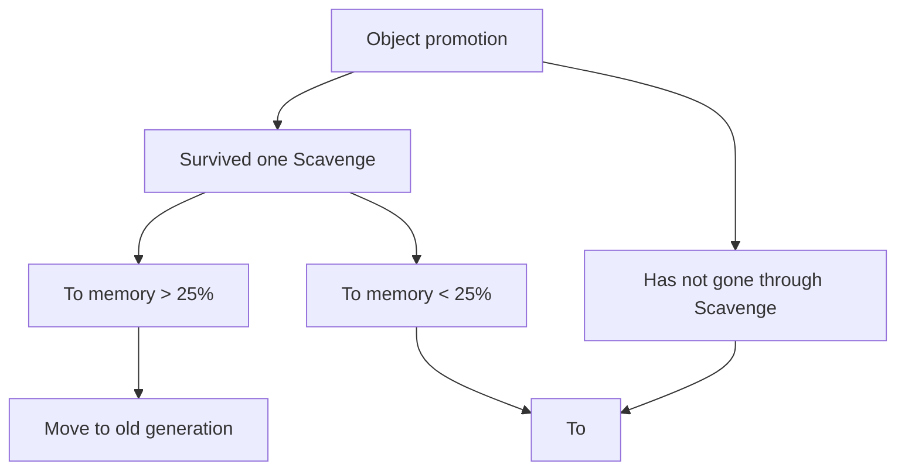

JavaScript usually runs in a browser or Node environment, and both (most browsers included) are based on the V8 engine.

### V8

V8 is a high-performance JavaScript and WebAssembly engine developed by Google. It is the foundation of Chrome, Node.js, and other environments.

~~V8 is actually an abbreviation for the eight letters after V, like `i18n`, `k8s`, and `ob` followed by a string of letters.~~

V8 was named by its development team after the V8 engine.

JavaScript is not machine language and cannot run directly as binary on a computer. V8 therefore **parses** it into an AST, then **compiles it into machine code or bytecode** (V8 should use machine code), so it can **execute and optimize it**.

When memory is insufficient, a browser may freeze, show a blank page, or crash (although users can of course refresh), harming the user experience. On the server, Node performance degrades and services may be interrupted.

### V8 memory limits

Prerequisite knowledge: objects are generally stored in the heap, while variables, contexts, and so on are stored on the stack.

Backend languages generally do not have such a memory limit, so why does V8 impose one?

V8 was initially a browser engine, so its default heap size was set to around 1.5 GB. A minor garbage collection could take more than 50 ms, while a non-incremental collection could take more than 1 second. Performance and responsiveness drop during that time. For browsers, 1.5 GB was already enough.

The limit is about 1.4 GB / 1464 MB on 64-bit systems and about 0.7 GB / 732 MB on 32-bit systems.

Servers have higher memory requirements, so V8 provides command-line options as well.

View them with `node --v8-options`.

When starting Node, pass `--max-old-space-size` or `--max-new-space-size` to adjust the memory limit. For example:

- `node --min-semi-space-size=1024 index.js`: set the minimum size, in MB, of one semi-space in the young generation.
- `node --max-semi-space-size=1024 index.js`: set the maximum size, in MB, of one semi-space in the young generation.
- `node --max-old-space-size=2048 index.js`: set the maximum size, in MB, of the old generation.

These parameters take effect during environment initialization. Once applied, they cannot be changed dynamically and must be adjusted manually. If memory is insufficient, this is one way to relax the limit.

Tip: use `// console.log(process.memoryUsage());` to inspect memory usage (by type).

```bash
{
  rss: 33456128,
  heapTotal: 4243456,
  heapUsed: 3387608,
  external: 1356637,
  arrayBuffers: 11151
}
```

The parameters returned by `memoryUsage` are:

- `rss` is short for resident set size: the process's resident memory.
- `heapTotal` is the heap memory already allocated.
- `heapUsed` is the amount currently in use.
- `external` represents memory used by C++ objects bound to JavaScript objects.

### V8's collection mechanism

Note: the principles of garbage-collection algorithms are probably similar to those in Java and C++.

V8's collection algorithm is based on **generational garbage collection**:

young generation and old generation.

#### Young generation

Within the generational model, young-generation objects are mainly collected using the `Scavenge` algorithm. Its concrete implementation uses the `Cheney` algorithm, a copying garbage-collection algorithm:

1. Divide the heap into two areas, each called a **semispace**.
2. Only one of the two semispaces is active; the other is idle.
3. The active space is called **From**, and the idle space is called **To**.
4. New objects are first allocated in **From**.
5. When collection starts, check which objects in **From** are alive.
6. Copy live objects to **To** and release the space occupied by dead objects.
7. After copying, swap the roles of **From** and **To**.

#### Object promotion

An object is promoted to the old generation after surviving in the young generation under certain conditions.

The two main conditions are:

- Whether the object has already gone through one Scavenge collection.
- Whether the memory usage of the To space has exceeded 25%.



#### Old generation: mark-sweep and mark-compact

Mark-sweep: steps 1–3.

Mark-compact: steps 1–5.

1. Traverse every object in the heap during the marking phase.
2. Mark live objects.
3. Remove unmarked objects during the sweeping phase.
4. Compact the memory space by moving live objects toward one end.
5. After moving, clear the memory beyond the boundary directly.

| **Collection algorithm** | **Mark-Sweep** | **Mark-Compact** | **Scavenge** |
| ---------------- | -------------- | ---------------- | ------------------ |
| **Speed** | Medium | Slowest | Fastest |
| **Space** | Low (fragmented) | Low (not fragmented) | Double space (not fragmented) |
| **Moves objects?** | No | Yes | Yes |

As the table shows, `mark-sweep` does not move objects, while the other two algorithms do. Those two therefore run more slowly than mark-sweep. As a trade-off, V8 mainly uses **Mark-Sweep** and only uses **Mark-Compact** when there is not enough space to allocate promoted objects.

### Memory leaks

To avoid memory leaks, let us look at how code can create them.

**Closures**

Closures are an important JavaScript concept; this post will not explain them in detail.

```jsx
function createCounter() {
  let count = 0; // Private variable

  return function () {
    // The returned function forms a closure
    count++; // Access and modify the outer function's variable
    return count;
  };
}

const counter = createCounter();
// console.log(counter()); // Outputs 1
// console.log(counter()); // Outputs 2
// console.log(counter()); // Outputs 3
```

Global variables:

```jsx
var a = 6;
// window.a = 6;

b = 3;
// window.b = 3
```

ES5 (before ES6 in 2015; most environments now use ES6):

```jsx
function a() {
  b = 6;
}
// window.b = 6;

function c() {
  this.d = 6;
}
// window.d = 6;
```

Global variables are accessible everywhere and therefore are not cleared.

Timers:

```jsx
// In Vue
created() {
    this.id = setInterval(op, 500);
},
beforeDestroy() {
    clearInterval(this.id);
},
// In React
useEffect(() => {
    const id = setInterval(op, 500);
    return () => clearInterval(id);
}, []);
```

Event listeners:

```jsx
// In Vue
created() {
    document.addEventListener('click', e => op(e));
},
beforeDestroy() {
    document.removeEventListener('click', e => op(e));
},
// In React
useEffect(() => {
    document.addEventListener('click', e => op(e));
    return () => document.removeEventListener('click', e => op(e));
}, []);
```

Q: Why can `// console.log` cause a memory leak?

A: When you use `// console.log()` to print an object, the browser's developer tools may **keep a reference to that object**.

Even if there are no other references in the code, the object may not be collected by the garbage collector. If you print a large object or one containing circular references, the reference held by the console may prevent the entire object graph from being collected.

In production code, `// console.log` statements are usually removed.

### Summary

Many parts of this article connect to computer-systems concepts. Basic knowledge helps us understand the underlying principles, broaden our perspective, and improve our thinking.
