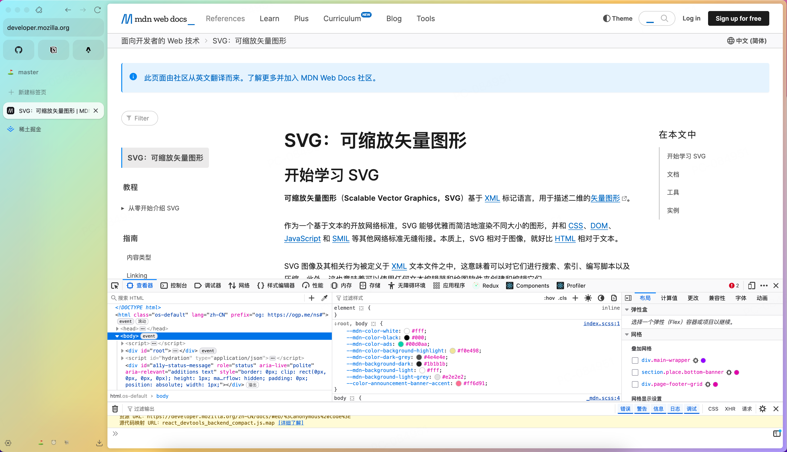

## for what

整理分类

### 像素蒸发

图片压缩，批量快速

[像素蒸发](https://moonvy.com/apps/PxEvapo/)

### 可画

ppt,微信封面图,海报,名片,logo

[可画](https://www.canva.cn/)

### 在线工具包

[在线工具](https://tool.lu/) 功能丰富

### 笔记工具

- [Notion](https://www.notion.so/)
- [语雀](https://www.yuque.com/)
- [typora](https://www.typora.io/)

### 技术周刊

- [阮一峰周报](https://www.ruanyifeng.com/blog/weekly/)

### 技术博客

- [可颂](https://react.iamkasong.com/#%E5%AF%BC%E5%AD%A6%E8%A7%86%E9%A2%91) react源码
- [峰华](https://zxuqian.cn/) 前端小知识

### 设计资源&美术资源

- [unDraw](https://undraw.co/) 免费的svg图标
- [unSplash](https://unsplash.com/) 免费图片
  文章封面就是通过接口免费获取，[开发者文档](<[https://unsplash.com/developers](https://unsplash.com/documentation)>)

### 前端ui

- [universe](https://uiverse.io/) ui小效果

### javascript生态

- [javascript.fun](https://www.javascript.fun/#) 衍生

### excalidraw 在线协作图笔记

- [excalidraw](https://excalidraw.com/) 手绘图

### 密塔搜索

- [text](https://metaso.cn/study)

ai搜索，资源总结为课，ppt形式。配合ai语音进行讲解，还有小测。

### mermaid 编辑器

[mermaid编辑器](https://mermaid.live/)

mermaid语法生成各类图（甘特，流程，ER等）,适合项目理清思路让ai生成对应图片，论文用图同理

### deepwiki

`https://deepwiki.com/{github地址}`

将项目文档生成wiki，并生成网站，配有图片，ai问答等

### zen

[zen官网](https://zen-browser.app/)

一个以firefox为内核的开源浏览器，[github](https://github.com/zen-browser/desktop)目前30多k的star  
beta版本特点是更高的隐私，平静。侧边标签页加分类,常用的设计感觉起来还行，目前还是google为主，尝尝鲜

###
