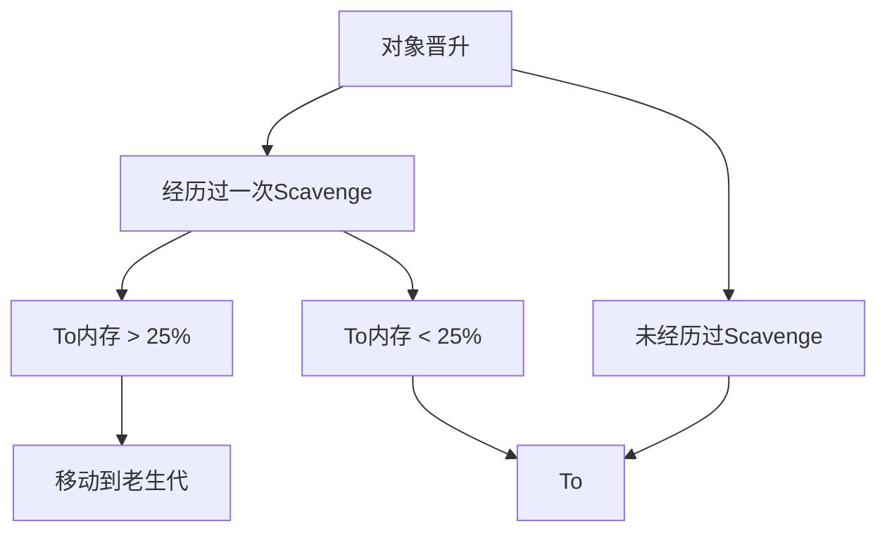

JavaScript 一般运行在浏览器或者node环境，而二者（大部分浏览器）都是基于 V8引擎。

### V8

V8 是由 Google 开发的高性能 JavaScript 和 WebAssembly 引擎，是Chrome 浏览器和 Node.js 等环境的基础。

~~V8其实是V后面8个字母的缩写，与 `i18n` `k8s` `ob后面一串字母` 一样，~~

V8是开发团队以V8发动机命名的

JavaScript不是机器语言，不能直接在电脑二进制跑，所以需要 V8 **解析** 为 AST，再**编译为机器码或字节码**（v8应该是机器码），才能够去**执行，再优化**

内存不足的时候，浏览器会卡顿白屏崩溃等（当然用户会手动刷新）影响用户体验，服务端node会性能劣化，服务中断

V8内存限制

前置知识：我们都知道用堆来存储对象等，栈来存储变量，上下文等

一般来说后端语言不会有内存限制，为什么v8 要对内存做限制了

v8一开始是作为浏览器引擎，所以默认设置堆内存大小为1.5g左右，做一次小的垃圾回收50ms以上，而做一次非增量式回收甚至需要1s以上，这期间性能和响应速度等下降，对于浏览器来说1.5g已经足够使用了。

服务端对内存有着更高要求，所以 v8 也提供了指令

可以通过查看 `node --v8-options`

在Node启动时，我们可以传递`--max-old-space-size`或者`--max-new-space-size`来调整内存限制大小，比如：

- `node --min-semi-space-size=1024 index.js` 设置新生代内存中单个半空间的内存最小值，单位MB
- `node --max-semi-space-size=1024 index.js` 设置新生代内存中单个半空间的内存最大值，单位MB
- `node --max-old-space-size=2048 index.js` 设置老生代内存最大值，单位MB

上述参数在环境初始化时生效，一旦生效，就不能动态改变，只能手动调整，如果遇到内存不够的情况，可以用这个方法手动放宽限制

tips: 可以通过 `console.log(process.memoryUsage());` 查看内存使用信息（单位type）

```bash
{
  rss: 33456128,
  heapTotal: 4243456,
  heapUsed: 3387608,
  external: 1356637,
  arrayBuffers: 11151
}
```

在memoryUsage方法返回的参数中：

- rss 是 resident set size 的缩写，是进程的常驻内存
- heapTotal 是已经申请到的堆内存
- heapUsed 是当前使用的量
- external 代表绑定到Javascript对象的 C++ 对象的内存使用情况

### V8回收机制

ps: 回收算法原理和java,c++等应该是类似的

V8的回收算法是基于 `分代式垃圾回收机制` ,

新生代与老生代

新生代

在分代的基础上，新生代中的对象主要通过 `Scavenge` 算法进行垃圾回收，具体实现中采用的是

`Cheney` 算法，这是一种采用复制的方式实现的垃圾回收算法，具体过程是：

1. 先将堆内存一分为二，每个内存空间称为 **semispace**（半空间）
2. 在这两个 **semispace** 中，只有一个处于使用中，另一个处于闲置中
3. 处于使用状态的空间称为 **From** 空间，处于闲置状态的空间称为 **To** 空间
4. 当我们分配对象时，先是在 **From** 空间中进行分配
5. 开始进行垃圾回收时，会检查 **From** 空间中存活的对象
6. 存活的被复制到 **To** 空间中，非存活对象占用的空间被释放
7. 完成复制后，**From** 空间和 **To** 空间的角色发生对换

对象晋升

即新生代存活满足特定条件后升级为老生代

满足对象晋升的条件主要有以下两个：

- 对象是否经历过一次Scavenge算法
- To空间的内存占比是否已经超过25%



老生代 **标记清除 & 标记整理**

标记清除 1-3

标记整理 1-5

1. 在标记阶段遍历堆中的所有对象
2. 然后标记活着的对象
3. 在清除阶段中，将未标记的对象进行清除
4. 对内存空间进行整理，将存活对象向一端移动
5. 移动完成后，直接清除掉边界外的内存

| **回收算法**     | **Mark-Sweep** | **Mark-Compact** | **Scavenge**       |
| ---------------- | -------------- | ---------------- | ------------------ |
| **速度**         | 中等           | 最慢             | 最快               |
| **空间**         | 少（有碎片）   | 少（无碎片）     | 双倍空间（无碎片） |
| **是否移动对象** | 否             | 是               | 是                 |

从上表中可以看到，`标记清除`不需要移动对象，其它两种算法需要移动对象，因此这两种算法的执行速度不如标记清除，所以在取舍上，V8主要使用`Mark-Sweep（标记清除）`，在空间不足以对晋升的对象进行分配时才使用`Mark-Compact（标记整理）`。

### 内存泄露

为了避免内存泄露，我们看看怎么写出内存泄露的代码

**闭包**

闭包是 JavaScript 的重要概念，这里不多赘述

```jsx
function createCounter() {
  let count = 0; // 私有变量

  return function () {
    // 返回的函数形成闭包
    count++; // 访问并修改外部函数的变量
    return count;
  };
}

const counter = createCounter();
console.log(counter()); // 输出 1
console.log(counter()); // 输出 2
console.log(counter()); // 输出 3
```

全局变量

```jsx
var a = 6;
// window.a = 6;

b = 3;
// window.b = 3
```

es5（2015es6，现在基本都是es6环境了）

```jsx
function a() {
  b = 6;
}
// window.b = 6;

function c() {
  this.d = 6;
}
// window.d = 6;
```

而全局变量都是可以访问到的，也就是不会被清除

定时器

```jsx
// 在vue中
created() {
    this.id = setInterval(op, 500);
},
beforeDestroy() {
    clearInterval(this.id);
},
// 在React中
useEffect(() => {
    const id = setInterval(op, 500);
    return () => clearInterval(id);
}, []);
```

事件监听

```jsx
// 在vue中
created() {
    document.addEventListener('click', e => op(e));
},
beforeDestroy() {
    document.removeEventListener('click', e => op(e));
},
// 在React中
useEffect(() => {
    document.addEventListener('click', e => op(e));
    return () => document.removeEventListener('click', e => op(e));
}, []);
```

Q: 为什么 `console.log` 会导致内存泄露

A: 当你使用 console.log() 打印一个对象时，浏览器的开发者工具会 **保留对该对象的引用**，

这使得即使在代码中没有其他引用，对象也可能不会被垃圾回收器回收，如果你打印了一个大型对象或包含循环引用的对象，控制台中的引用可能会阻止整个对象图被回收

生产环境代码中通常会移除 console.log 语句

### 总结

不难发现，文章很多地方与计算机系统等知识相关，基础知识可以帮助我们理解原理，有助于我们扩宽眼界，提升思维等等
